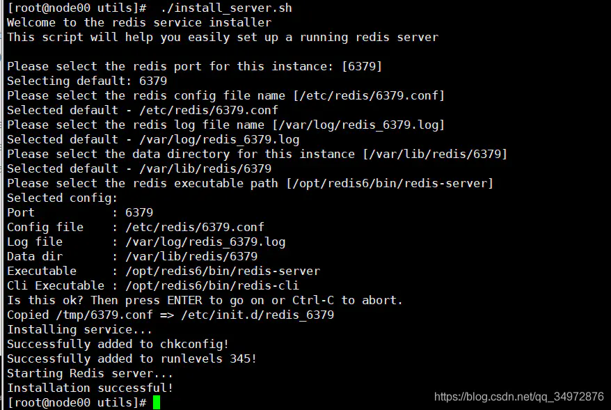

# Centos7环境下Redis的安装配置 #
## 一、检查本地是否安装 ##
### 1、检查 ###
    rpm -qa | grep redis
    cd /usr/local/
### 2、卸载 ###
    rpm -e redis
## 二、下载 ##
### 1、wget方式下载 ###
    wget http://download.redis.io/releases/redis-6.2.6.tar.gz
##### 若报错：`-bash: wget: command not found` 表明没有安装wget，需要执行如下命令安装： #####
    yum -y install wget
## 三、解压操作文件 ##
### 1、解压 ###
    tar -zxvf redis-6.2.6.tar.gz -C /usr/local/
### 2、编译文件 ###
    cd /usr/local/redis-6.2.6/
	ll
    yum -y install make
	make
#### 3、出现问题 ####
	cd src && make all
	make[1]: 进入目录“/software/redis-6.2.6/src”
		CC Makefile.dep
	make[1]: 离开目录“/software/redis-6.2.6/src”
	make[1]: 进入目录“/software/redis-6.2.6/src”
		CC adlist.o
	/bin/sh: cc: 未找到命令
	make[1]: *** [adlist.o] 错误 127
	make[1]: 离开目录“/software/redis-6.2.6/src”
	make: *** [all] 错误 2
#### 4、解决方案 ####
##### 安装gcc环境 #####
	yum install gcc-c++
##### 升级 #####
	yum -y install centos-release-scl
	yum -y install devtoolset-9-gcc devtoolset-9-gcc-c++ devtoolset-9-binutils
##### 清空，不然会有问题的 #####
	make distclean
##### 再去执行 2、编译文件 #####
	make
### 3、安装Redis ###
	cd src
	make install

## 四、修改配置文件 ##
### bind需注释掉，其余两项参数设置为如下 ##
	#bind 127.0.0.1
	protected-mode no
	daemonize yes

## 五、启动 ##

	cd /usr/local/redis-6.2.6/
	
	src/redis-server  redis.conf
	
### 停止 ###
	redis-cli shutdown

## 六、开机自启
### 1、找到./install_server.sh脚本
    cd /usr/local/redis-6.2.6/utils
### 2、编辑文件
    vim ./install_server.sh
#### 注释下面的代码
    #bail if this system is managed by systemd
    #_pid_1_exe="$(readlink -f /proc/1/exe)"
    #if [ "${_pid_1_exe##*/}" = systemd ]
    #then
    #       echo "This systems seems to use systemd."
    #       echo "Please take a look at the provided example service unit files in this directory, and adapt and install them. Sorry!"
    #       exit 1
    #fi
##### 按一下`esc`键 退出编辑 #####
##### `:wq` 保存退出 #####

### 3、然后运行
    ./install_server.sh

#### 根据提示依次输入：完成后成功如下

#### 查看该实例的运行状态
    service redis_6379 status
#### 停止
    service redis_6379 stop
#### 启动
    service redis_6379 start
#### 重启计算机 ####
	shutdown -r now

## 七、防火墙端口开放 ##

### 1、查看防火墙状态 ###
	firewall-cmd --state
### 2、关闭防火墙 ###
	systemctl stop firewalld.service
### 3、禁止防火墙开机自启 ###
	systemctl disable firewalld.service
### 4、开启防火墙 ###
	systemctl start firewalld.service
### 5、Add 添加开放端口 ###
	firewall-cmd --permanent --zone=public --add-port=6379/tcp
### 6、Reload 重新加载 ###
	firewall-cmd --reload
### 7、检查是否生效 ####
	firewall-cmd --zone=public --query-port=6379/tcp